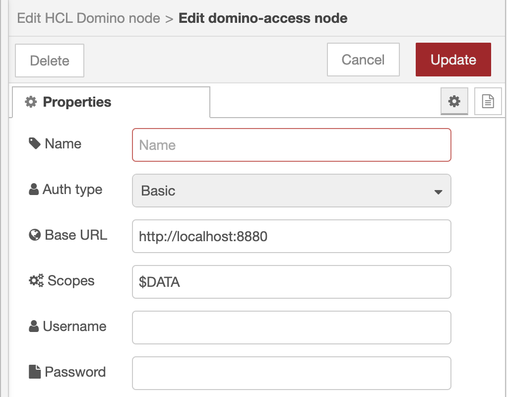

# NodeRED access to HCL Domino's REST API

(C) 2025 HCL America Inc. Apache-2.0 license [https://www.apache.org/licenses/LICENSE-2.0](https://www.apache.org/licenses/LICENSE-2.0)

[](https://www.npmjs.com/package/@hcl-software/node-red-domino)

This repository contains the NodeRED nodes to interact with the HCL Domino REST API. It uses the [Domino REST API SDK for NodeJS](https://github.com/HCL-TECH-SOFTWARE/domino-rest-sdk-node) under the hood.


## Installation

Install the palette manager or `npm` like any other [NodeRED](https://nodered.org/) node.

```bash
npm install @hcl-software/node-red-domino
```

The installation will add one node in `network` and two related configuration nodes.


Each node gets configured with a credential and a connection configuration node. Multiple Domino can share the same credential and connection node.

## Usage

Each Domino node can be configured to execute [**one operation ID**](https://opensource.hcltechsw.com/Domino-rest-api/topicguides/howkeepworks.html?h=operationid). The node translates the operation ID into the actual operation URL and checks for mandatory parameters.

### Configuration

A new node and the related configuration nodes show regular entry fields:





After saving and re-opening the dialogs query the server and populate the drop-down list:


Check the node help and the official [Domino REST API Documentation](https://opensource.hcltechsw.com/Domino-rest-api/) for details, especially around [operation IDs](https://opensource.hcltechsw.com/Domino-rest-api/references/openapidefinitions.html)

### Flows

- Refer to the example directory.
- All parameters (well most of) are in the `msg.payload`.
- Payload can have a `params` object for parameters and a `body` object for request bodies. Both objects are optional.
- You can specify a `msg.unid` to interact with one document.
- Responses that can have more than one result (lists, query) emit on result for each entry. This can be switched off using `single result (no splitting)`.

## Known limitations

- To take advantage of the selection list, you need to add the credential and connection configuration nodes and close the Domino node. On open, the configuration queries the server and offers APIs, scope and operation IDs found on your selected server.
- The HTTP response node can't send chunked responses, so in a HTTP flow you need to select `single result (no splitting)`.

## Documentation


- [Domino REST API Documentation](https://opensource.hcltechsw.com/Domino-rest-api/)

## Feedback & Contribution

- [Issues](https://github.com/HCL-TECH-SOFTWARE/domino-rest-sdk-nodered/issues)
- [OpenNTF discord](https://discord.com/invite/jmRHpDRnH4)
- Pull requests accepted - [Contributions](CONTRIBUTING.md)
- [Code of conduct](CODE_OF_CONDUCT.md)

## Changelog

### 0.1.0 November 2023 Release

- initial release

### 0.1.1

- Credential configuration node now has three authentication types:

  - basic
  - oauth
  - token
